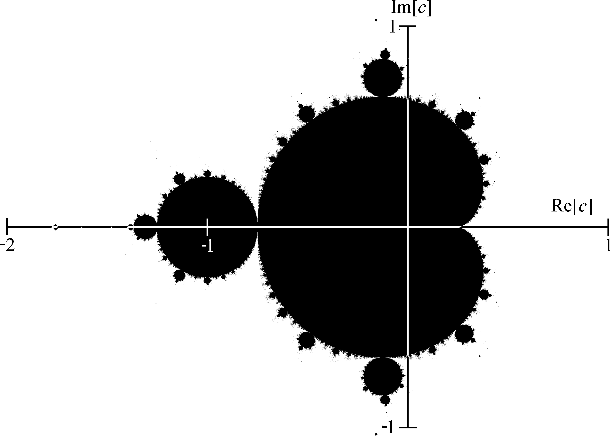

Tutorial: Fractals
===================

.. epigraph::

   In mathematics, a fractal is a subset of Euclidean space with a fractal dimension that strictly exceeds its topological dimension.

   -- Wikipedia

.. epigraph::

   A fractal is a never-ending pattern. Fractals are infinitely complex patterns that are self-similar across different scales.
   They are created by repeating a simple process over and over in an ongoing feedback loop.
   Fractal patterns are extremely familiar, since nature is full of fractals. For instance: trees, rivers, coastlines, mountains,
   clouds, seashells, hurricanes, etc.

   -- Fractal Foundation

Fractals are very interesting things if you're studying maths, but even if you are not, they are still just plain fun because:

* They make pretty pictures when drawn on the screen.
* They require very little code to draw.
* You can zoom in forever and always find new details, yet you don't have to write any extra code.

We are going to write a program to draw one fractal in particular, the Mandelbrot set.

Mandelbrot set
--------------

We are going to skip through the maths so we can get straight to coding, but if you would like to understand complex numbers,
`watch this video <https://youtu.be/NGMRB4O922I>`_ or ask your maths teacher.

Every complex number is either *in* the Mandelbrot set, or *out* of the Mandelbrot set.  To decide which it is, we
do an iteration:

.. math::

   z_{n+1} = {z_n}^2 + c

If *z* gets bigger and bigger (tends towards infinity) then *c* is in the set.  If it stays in the range of -2 to 2,
then *c* is not in the set.  However, we don't want to perform the iteration infinity times, so we are going
to limit it to 80 iterations of the loop.  If it's still in the range after that, we will return 80.  If it goes outside
the range, then we will return how many iterations it took.

(We could have simply returned True or False but we are going to use the number of iterations for something later.)

Here is our function.  It *takes* a complex number ``c``, and it *returns* the number of iterations
(which will be 80 if ``c`` is in the Mandelbrot set.)

..  code-block::

    MAX_ITER = 80

    def mandelbrot(c):
        z = 0
        n = 0
        while abs(z) <= 2 and n < MAX_ITER:
            z = z * z + c
            n += 1
        return n

Now we just need a function to draw the points on the screen.  We have two ``for`` loops, one inside the other,
which loop over every pixel on the screen.  For each pixel, we convert the ``x`` and ``y`` coordinates into a complex
number.  We then send that number to the ``mandlebrot()`` function, and depending on what it returns we plot either a black
pixel or a white pixel.

..  code-block::

    def draw2d():
        for x in range(0, WIDTH):
            for y in range(0, HEIGHT):
                c = complex((RE_START + (x / WIDTH) * RE_WIDTH),
                            (IM_START + (y / HEIGHT) * IM_HEIGHT))
                m = mandelbrot(c)
                color = BLACK if m == MAX_ITER else WHITE
                screen.draw_pixel(x, y, color)

   Complex plain

A Mandlebrot is drawn in the *complex plain*.  This means that the axes are not labelled *x* and *y*.  Instead we call
the horizontal axis *RE* (for 'real') and the vertical axis *IM* (for 'imaginary').  These terms come from the maths
of complex numbers.  So we define some constants to specify the left, right, top and bottom limits of the graph:

..  code-block::

    RE_START = -2
    RE_END = 1
    IM_START = -1
    IM_END = 1
    RE_WIDTH = (RE_END - RE_START)
    IM_HEIGHT = (IM_END - IM_START)

Here is the complete program to type in and run:

.. literalinclude:: programs/mand6.py
   :caption: Mandlebrot set
   :name: code-mandelbrot
   :linenos:

Shades of Grey
--------------

The reason we returned the number of iterations is that for a point *outside* of the Mandlebrot set, this number
tells us how far outside it is.  So instead of just plotting black and white for *in* or *out* we can plot shades of grey.

Here is the modified function that does this,

..  code-block::
    :emphasize-lines: 7-8

    def draw2d():
        for x in range(0, WIDTH):
            for y in range(0, HEIGHT):
                c = complex((RE_START + (x / WIDTH) * RE_WIDTH),
                            (IM_START + (y / HEIGHT) * IM_HEIGHT))
                m = mandelbrot(c)
                i = 255 - int(255 * m / MAX_ITER)
                color = (i, i, i, 255)
                screen.draw_pixel(x, y, color)

Modify your ``draw2d()`` function and run.

Colours
-------

In the previous function we created an *RGB* ``color`` where the red, green and blue values were the all same, i.e. a shade of grey.

*RGB* is the most common colour space, but it is not only one.  The *HSV* colour space is useful because one single value, the *hue*,
can be changed to produce completely different colours.

..  code-block::
    :emphasize-lines: 7-10

    def draw2d():
        for x in range(0, WIDTH):
            for y in range(0, HEIGHT):
                c = complex((RE_START + (x / WIDTH) * RE_WIDTH),
                            (IM_START + (y / HEIGHT) * IM_HEIGHT))
                m = mandelbrot(c)
                hue = int(255 * m / MAX_ITER)
                saturation = 255
                value = 255 if m < MAX_ITER else 0
                color = screen.color_from_hsv(hue, saturation, value)
                screen.draw_pixel(x, y, color)

Modify your ``draw2d()`` function and run.

Zooming in
----------

Lets introduce a new variable, *zoom*.  We will multiply our co-ordinates by this factor to enable zooming.

We will also add an ``update`` function.  This is called automatically and will handle input.  You can now
hold down the space and enter to zoom in and out, and hold the cursor keys to move around.

.. literalinclude:: programs/mand5c.py
   :caption: Mandlebrot set with colour and zooming
   :name: code-mandelbrot2
   :linenos:
   :emphasize-lines: 13, 28, 29, 38-51

This is the complete program.  Modify yours to match, or enter it again, and run it.

.. note:: Zooming may be slow and you may have to hold for a long time.  We will try to improve this next.

Performance
-----------

The ``draw2d()`` function is called automatically, up to 60 times per second, and every time it is called we plot
a new fractal.  This is very inefficient, because we are re-plotting the fractal even when it has not changed at all.

So, we will move the plotting code into a new function.  Instead of plotting directly to the screen, we will create
an ``image`` object and plot to this.

..  code-block::

    def plot_image():
        for x in range(0, WIDTH):
            for y in range(0, HEIGHT):
                c = complex((RE_START + (x / WIDTH) * RE_WIDTH),
                            (IM_START + (y / HEIGHT) * IM_HEIGHT))
                m = mandelbrot(c)
                hue = int(255 * m / MAX_ITER)
                saturation = 255
                value = 255 if m < MAX_ITER else 0
                color = pyray.color_from_hsv(hue, saturation, value)
                screen.image_draw_pixel(image, x, y, color)

    image = screen.gen_image_color(WIDTH, HEIGHT, GREEN)
    plot_image()

We can't draw the ``image`` directly to the screen; it must be converted into a ``texture`` first.  Unfortunately we can't create
a ``texture`` too early in the program, because it requires the GPU to have been initialized.  Therefore we do this in a special ``init()``
function which RLZero calls automatically after initialization.

..  code-block::

    def init():
        global texture
        texture = screen.load_texture_from_image(image)
        screen.set_texture_filter(texture, screen.TEXTURE_FILTER_BILINEAR)

Now our ``draw2d()`` function only has to update the ``texture`` based on the latest ``image`` and draw it to the screen, which
is much faster than re-plotting the whole thing.

..  code-block::

    def draw2d():
        screen.update_texture(texture, image.data)
        screen.draw_texture_ex(texture, (0, 0), 0, 1, WHITE)

Finally, we must remember to re-plot the image if the user presses any keys:

..  code-block::

    def update():
        global zoom, IM_START, RE_START
        if keyboard.space:
            zoom = zoom * 1.2
            plot_image()
        elif keyboard.enter:
            zoom = zoom * 0.8
            plot_image()
        elif keyboard.up:
            IM_START -= 0.2
            plot_image()
        elif keyboard.down:
            IM_START += 0.2
            plot_image()
        elif keyboard.left:
            RE_START -= 0.2
            plot_image()
        elif keyboard.right:
            RE_START += 0.2
            plot_image()

.. literalinclude:: programs/mand5e.py
   :caption: Mandlebrot set with improved performance
   :name: code-mandelbrot3
   :linenos:

Quality setting
---------------

It would be nice if we could make the window bigger so we can see the fractal more easily, but depending on the speed
of your computer you may already find even the small window is very slow.

A simple way of speeding it up is to plot the image at a lower resolution and scale it up to full size when we
draw the texture to the screen.

Change the resolution at the top of the program, and add a ``SCALE`` variable:

..  code-block::

    WIDTH = 1920
    HEIGHT = 1080
    SCALE = 4

Change the first part of the ``plot_image`` function to use the ``SCALE``:

..  code-block::

    def plot_image():
        for x in range(0, WIDTH//SCALE):
            for y in range(0, HEIGHT//SCALE):
                c = complex((RE_START + (x / (WIDTH//SCALE)) * RE_WIDTH) * zoom,
                            (IM_START + (y / (HEIGHT//SCALE)) * IM_HEIGHT) * zoom)

Change the ``draw_2d()`` function to use the ``SCALE``:

..  code-block::

    def draw2d():
        screen.update_texture(texture, image.data)
        screen.draw_texture_ex(texture, (0,0), 0, SCALE, WHITE)

Run the program and experiment with different ``SCALE`` values.

Further improvements
--------------------

If you have ever used a fractal viewer program before, you will probably notice that it is faster than the simple one we have written.
How could we make ours faster?

* Divide the image up into parts and use multiple CPUs to plot the different parts of the image simultaneously.
* Save images once they are plotted so they don't need to be plotted again if the user returns to them.
* When scrolling, don't re-plot the whole image; just move the existing data and re-plot the now empty part.
* When zooming in, first scale-up the existing image to generate a low quality zoomed image, then plot a higher quality one later.
* Begin plotting with a low resolution image and then replace it with a higher resolution one later.